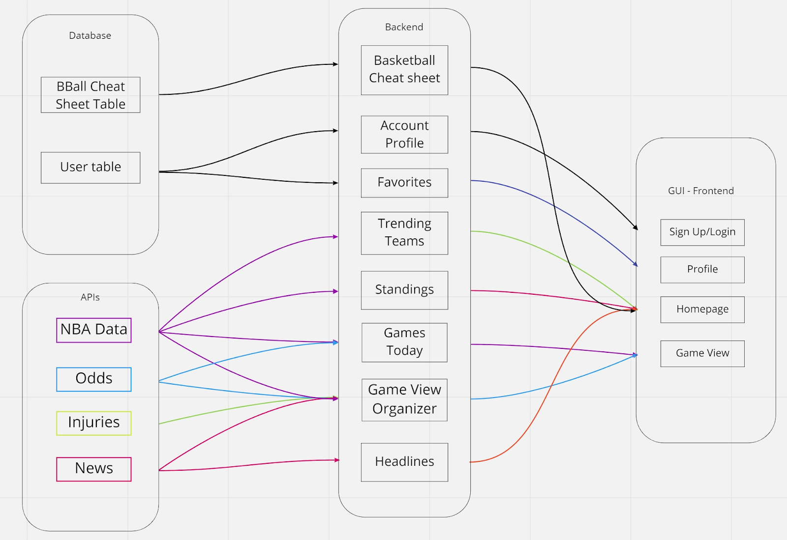
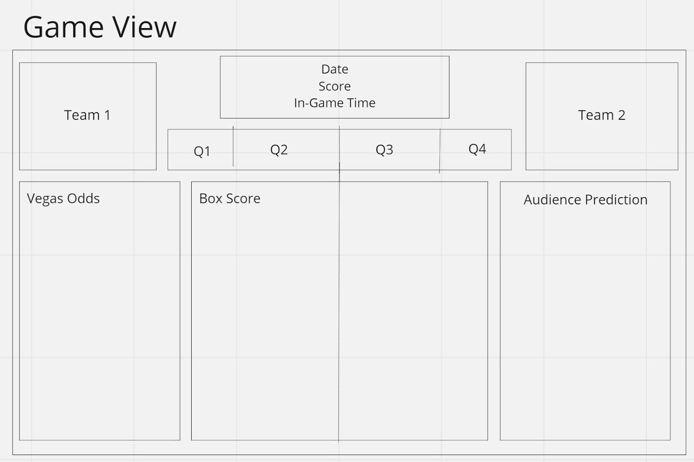
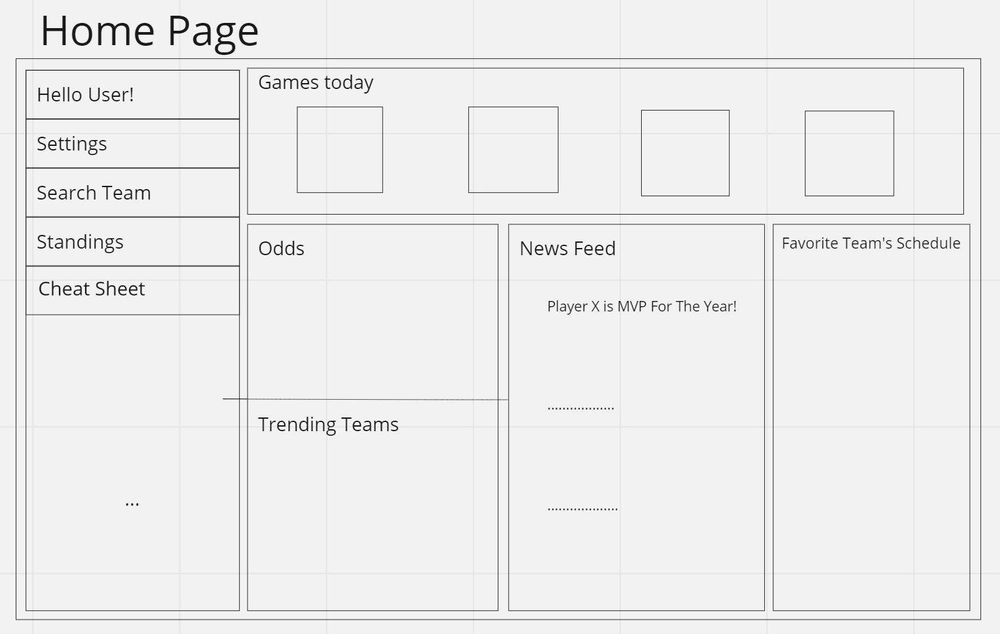
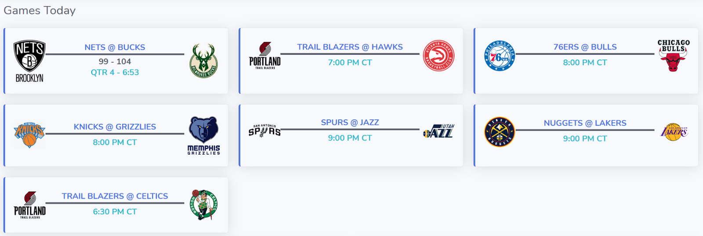
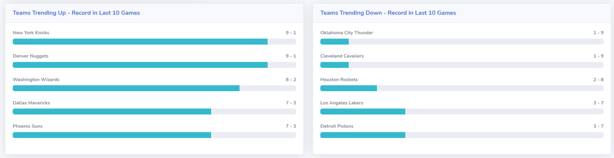
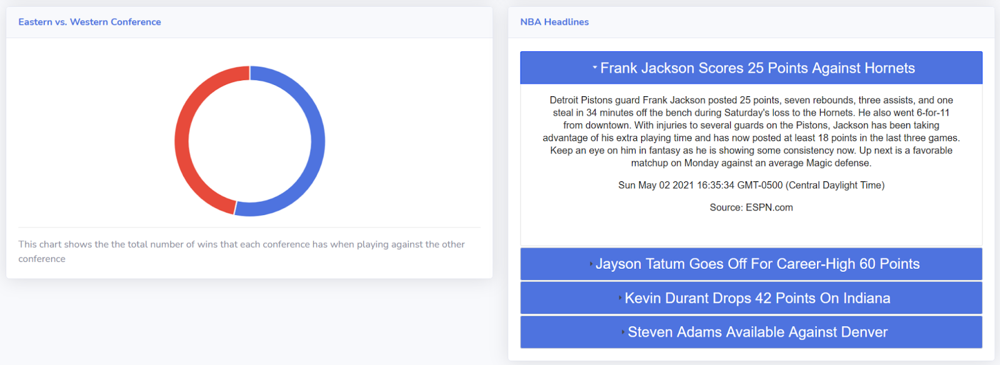
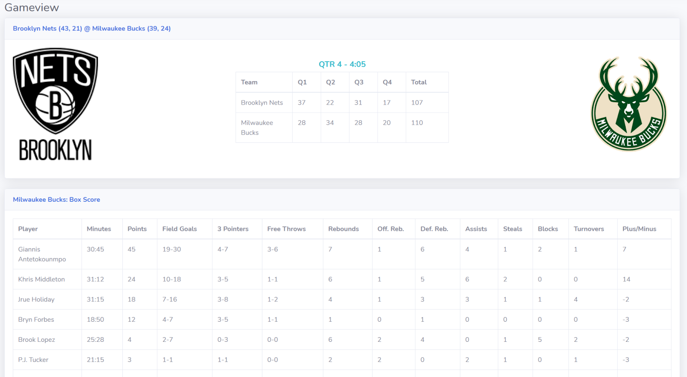
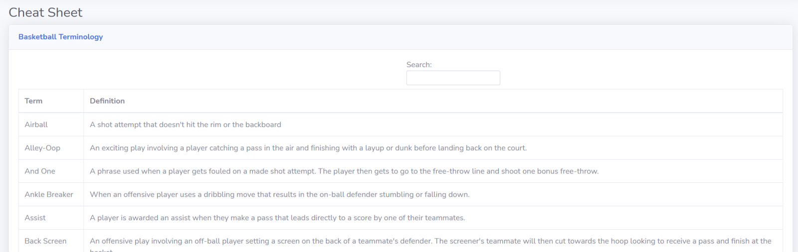
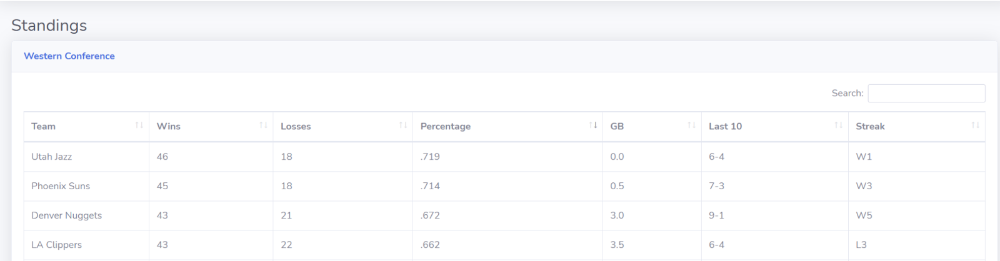

  
  <h3 align="center">SimplyBasketball</h3>
  

    Basketball fan site made using various APIs, HTML/CSS, and JavaScript
  

  
Table of Contents

  <ol>
    <li>
      <a href="#about-the-project">About The Project</a>
      <ul>
        <li><a href="#built-with">Built With</a></li>
      </ul>
    </li>
    <li><a href="#usage">Usage</a></li>
    <li><a href="#license">License</a></li>
    <li><a href="#sources">Sources</a></li>
  </ol>

## About the Project

Whether you are a new or seasoned basketball fan, this website was created to compile frequently used sources to be an up-to-date site on all things basketball. New fans may enjoy our breakdown of common basketball terminology and seasoned fans may enjoy the information regarding teams and individual players. The website can be viewed using the following link: https://simplybasketball.herokuapp.com/

### Built With:
* HTML
* CSS
* JavaScript
* APIs
* Bootstrap
* jQuery
* JSON

System Design

User-Interface Design

## Usage

## Sources
* balldontlie API (NBA game status): [https://www.balldontlie.io/#introduction](https://www.balldontlie.io/#introduction)
* API-BASKETBALL (Odds): [https://rapidapi.com/api-sports/api/api-basketball](https://rapidapi.com/api-sports/api/api-basketball)
* API-NBA (Player/Game Stats): [https://rapidapi.com/api-sports/api/api-nba](https://rapidapi.com/api-sports/api/api-nba)
* Sportsdata NBA API (NBA Headlines): [https://sportsdata.io/developers/api-documentation/nba](https://sportsdata.io/developers/api-documentation/nba)
* Heroku: [https://www.heroku.com/](https://www.heroku.com/)

### Images
* Top 6 Software Development Life Cycle (SDLC) Models & Methodologies: [https://agiletech.vn/top-software-development-life-cycle-models/](https://agiletech.vn/top-software-development-life-cycle-models/)

## License
Distributed under the MIT License. See `LICENSE` for more information.
